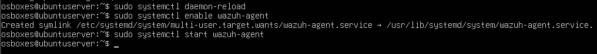
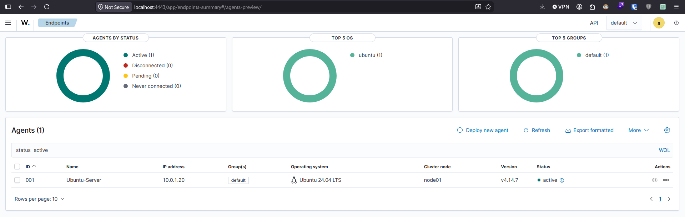
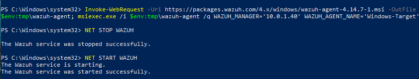

# Currently building... cybersecurity-homelab

## 📑 Índice

1. [Network Topology](#1-network-topology)
2. [Installing Wazuh Server](#2-installing-wazuh-server)
3. [Installing Wazuh Agents](#2-installing-wazuh-agents)

## 1. Network Topology


## 2. Installing Wazuh Server

### Wazuh Installation Guide

| VM    | RAM |  CPU (cores) | Disk |
| -------- | ------- | -------- | ------- |
| Ubuntu Server 22.04  | 8GB   |  4    |  50GB    |

### Wazuh Main Components

Before installing **Wazuh**, we have to understand its components.

1. **Wazuh indexer**: Its main purpose is to **store** and **index** alerts generated by the Wazuh Server
2. **Wazuh server**: Analyzes data received from the Wazuh agents.
3. **Wazuh dashboard**: Is the **GUI** for data visualization and analysis.
4. **Wazuh agent**: It is installed on the **endpoints** such as laptops, servers ... They provide threat detection, and response capabilities.

### Wazuh VM Installation

First, we need to download the ova file from the  [wazuh site](https://documentation.wazuh.com/current/deployment-options/virtual-machine/virtual-machine.html).
Import the ova


Then we need to configure the network, in my case with NAT Network. And configure an IP address.


Now, lets set an IP address to the interface

`sudo nano /etc/systemd/network/20-eth0.network`
```
[Match]
Type=ether

[Network]
Address=10.0.1.40/24
Gateway=10.0.1.1
DNS=8.8.8.8
DNS=1.1.1.1

```
`sudo systemctl restart systemd-networkd`

All done! Now we can connect to the GUI


## 3. Installing Wazuh Agents

### Ubuntu Server 22.04

Let's install the Wazuh Agent on the Ubuntu Server
On the GUI we click deploy new agent and we have to introduce the Wazuh Server IP and assign an agent name.


And on the Ubuntu Server we run the following command


Start the agent



And check the GUI



### Windows Client

On the Wazuh GUI we select Windows and copy the command 




