# Cybersecurity Homelab

## Table of Contents

- [Cybersecurity Homelab](#cybersecurity-homelab)
  - [Table of Contents](#table-of-contents)
  - [1. Network Topology](#1-network-topology)
  - [2. Installing the Wazuh Server](#2-installing-the-wazuh-server)
    - [Wazuh Installation Guide](#wazuh-installation-guide)
    - [Wazuh Components](#wazuh-components)
    - [Wazuh VM Installation](#wazuh-vm-installation)
  - [3. Installing Wazuh Agents](#3-installing-wazuh-agents)
    - [Ubuntu Server 22.04](#ubuntu-server-2204)
    - [Windows Client](#windows-client)
  - [4. PoC: SSH Brute-Force Attack Against an Ubuntu Server](#4-poc-ssh-brute-force-attack-against-an-ubuntu-server)
    - [Wazuh Logs](#wazuh-logs)
    - [Configuring Automatic Response](#configuring-automatic-response)
    - [Active Response Behavior](#active-response-behavior)

## 1. Network Topology

The lab consists of a minimal environment with a Wazuh manager, several monitored endpoints, and an attacker machine.

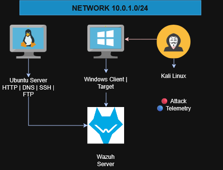

## 2. Installing the Wazuh Server

### Wazuh Installation Guide

The lab uses the following virtual machine specification:

| VM | RAM | CPU (cores) | Disk |
| --- | --- | --- | --- |
| Ubuntu Server 22.04 | 8GB | 4 | 50GB |

### Wazuh Components

Before installing Wazuh, it is important to understand its main components.

1. **Wazuh indexer**: stores and indexes alerts generated by the Wazuh server.
2. **Wazuh server**: analyzes data received from the Wazuh agents.
3. **Wazuh dashboard**: provides the graphical user interface for visualization and analysis.
4. **Wazuh agent**: is installed on endpoints such as laptops and servers to provide threat detection and response capabilities.

### Wazuh VM Installation

The first step is to download the OVA image from the official Wazuh documentation:

[Wazuh Virtual Machine Documentation](https://documentation.wazuh.com/current/deployment-options/virtual-machine/virtual-machine.html)

Once downloaded, import the OVA into the virtualization platform.

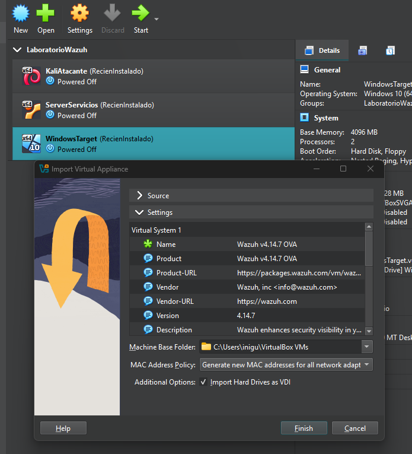

Next, configure the network. In this setup, NAT Network was used and a static IP address was assigned.

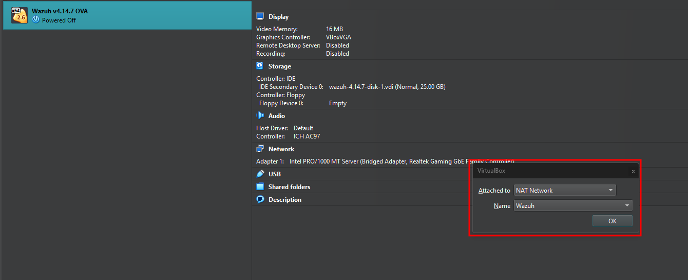

Now, let’s set a static IP address on the interface.

`sudo nano /etc/systemd/network/20-eth0.network`

```ini
[Match]
Type=ether

[Network]
Address=10.0.1.40/24
Gateway=10.0.1.1
DNS=8.8.8.8
DNS=1.1.1.1
```

Then restart the network service:

```bash
sudo systemctl restart systemd-networkd
```

Once the service is restarted, the Wazuh dashboard can be accessed through the browser.

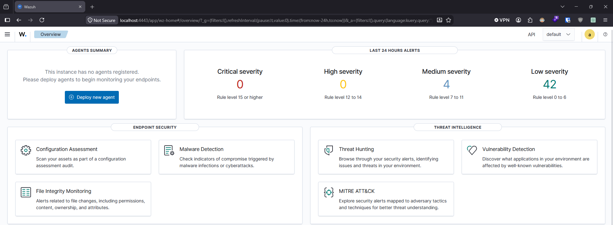

## 3. Installing Wazuh Agents

### Ubuntu Server 22.04

To install the Wazuh agent on the Ubuntu Server, open the Wazuh dashboard and create a new agent. Enter the Wazuh server IP address and assign a name to the agent.

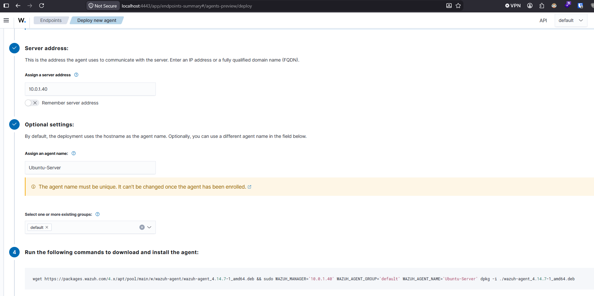

On the Ubuntu Server, run the installation command generated by the dashboard.

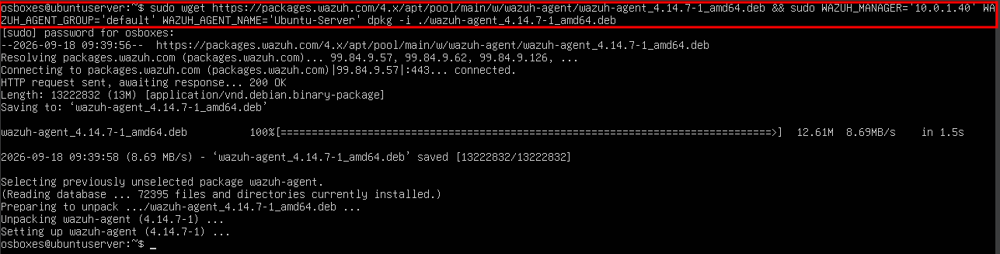

Start the agent:

```bash
sudo systemctl start wazuh-agent
```

Then verify that it appears as active in the Wazuh dashboard.


### Windows Client

On the Wazuh dashboard select Windows and copy the command


Run the command on the Windows machine and confirm that the agent connects to the Wazuh server.

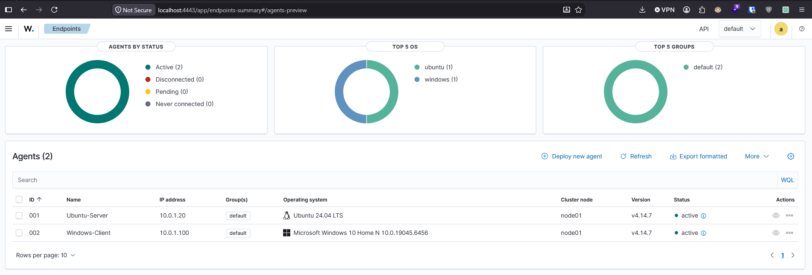

## 4. PoC: SSH Brute-Force Attack Against an Ubuntu Server

In this section, we simulate a brute-force attack against the SSH service running on the Ubuntu Server. Later, we implement Wazuh Active Response, which is a module that automates response actions based on specific triggers.

The goal is to create an automatic response to the brute-force attack and compare the system before and after implementing Active Response.

Once SSH is installed and enabled on the Ubuntu Server, the host is ready to be targeted.

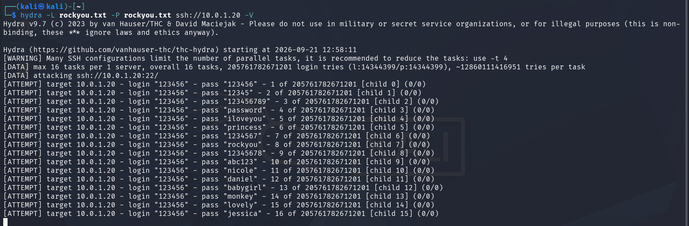

### Wazuh Logs

During the attack, Wazuh detects repeated authentication failures and suspicious behavior associated with credential access attempts.

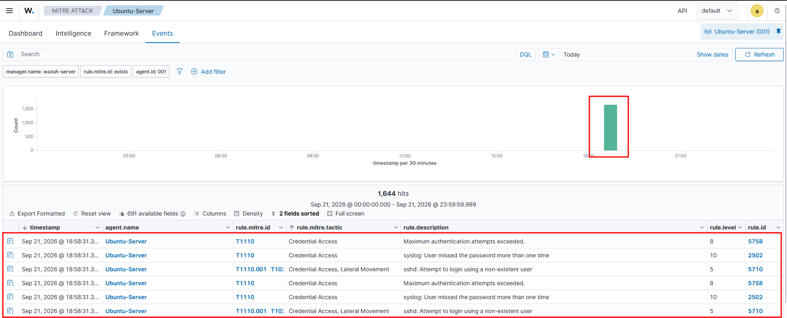

At this point, the system is still exposed because Wazuh is identifying the attack, but no automated action has been triggered yet.

This is where Active Response becomes useful.

### Configuring Automatic Response

On the Wazuh manager, we add an active-response block. We specify the rule ID and the command to execute. In this case, the command is `firewall-drop`, which blocks the source IP address for a configured period of time.

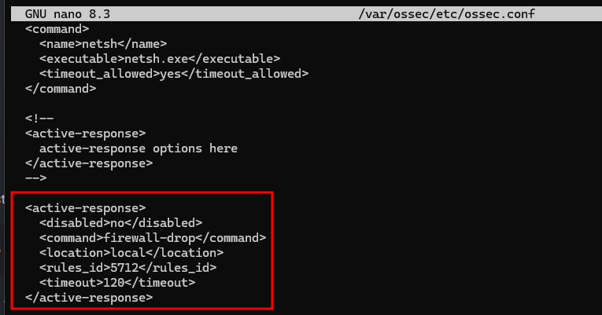

After updating the configuration, restart the Wazuh manager:

```bash
sudo systemctl restart wazuh-manager
```

This enables automatic blocking based on the configured rule.

### Active Response Behavior

Running the attack on Kali

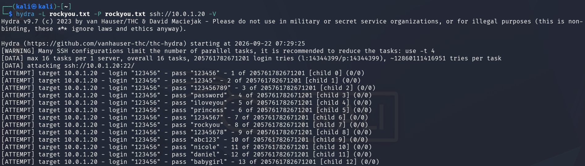
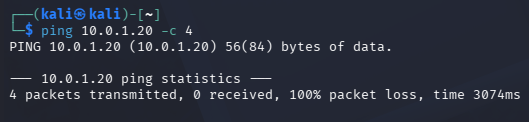

On the Ubuntu Server, the firewall blocks the malicious IP address.

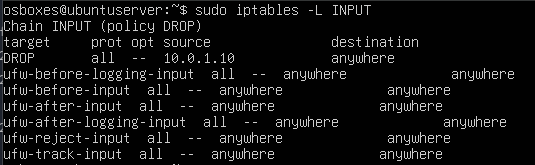

The Wazuh dashboard shows the corresponding security alerts and the response triggered by the manager.

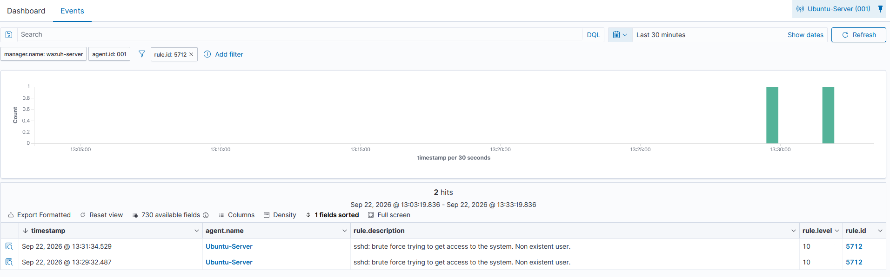

Because the timeout is configured to 2 minutes, the firewall rule disappears automatically after the block period expires.

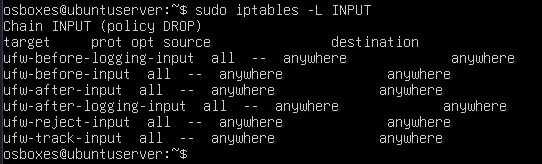
